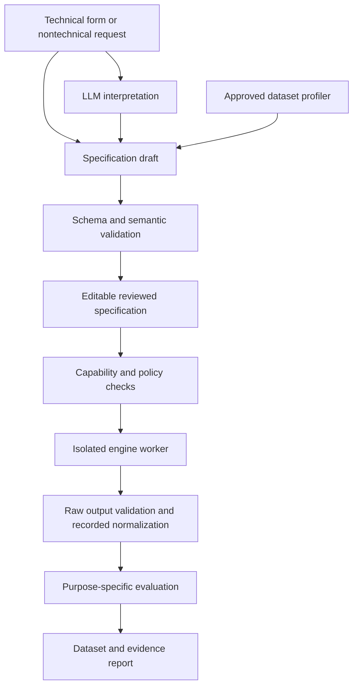

# Proposed PoC stack and architecture

## Decision

Build a general-purpose **structured-data PoC** with two first-class paths: schema/rule generation and learned single-table generation. Make domain-specific knowledge optional. Use an engine contract that can later support relational, temporal and other modalities without pretending those capabilities are already implemented.

The first implementation should use **Faker + explicit rules** for schema-only scenarios and **arfpy behind a small adapter** for learned tables. Keep DataSynthesizer as a transparent comparison engine. Keep the benchmark's Copulas adapter as a comparator whose BSL license requires a deployment decision. These are proposed platform choices; the platform itself has not been built in this review.

ARF is selected for its MIT license, modest integration surface and observed utility—not because it won every task. It led the tested generators on banking, while the copula adapter did better on education. No claim of universal superiority or privacy protection follows. [Executed evidence](04_benchmark_report.md)

## Component decisions

| Component | Initial choice | Why / evidence | Status |
|---|---|---|---|
| Rule generation | Faker + bounded declarative rules | Executed across retail/education/sensor scenarios; assumptions remain explicit | Proposed integration; examples executed |
| Learned synthesis | arfpy 0.1.1 adapter | Executed on three domains; MIT; preserve normalization/reporting | Proposed integration; benchmark executed |
| Statistical comparison | DataSynthesizer 0.1.13 | Inspectable conditional model and executed baseline | Benchmark/reference |
| Neural breadth | Separate Synthcity worker | Useful plugin architecture; substantial dependency differences | Later integration candidate |
| Differential privacy | Separate SmartNoise worker | Explicit preprocessing and mechanism budget controls | Required experiment before enabling DP claims |
| Evaluation | Local pandas/SciPy/scikit-learn measures; assess SDMetrics | Actual benchmark measures available; richer coverage still required | Basic measures executed |
| Privacy audit | TAPAS-style threat-model harness | Relevant adversarial framework; no local attack results yet | Future required work for sensitive releases |
| Specification | Versioned JSON Schema plus semantic validator | Separates request interpretation from execution | Draft schema and examples supplied |
| LLM | Provider-independent structured-output adapter | Requirement translation and explanation; no benchmark yet | Proposed, unselected provider |
| Interface | Editable form + assistant, backed by same specification | Allows comparison of technical and nontechnical workflows | Proposed |

Do not make Synthcity the platform's internal data model. Our interface should be stable even if a worker, Python version or dependency changes. Nor should the LLM select unsupported engines merely because their names appear in a prompt.

## Execution flow



For future private-data mode, profiling, training, caches, raw metrics and learned models stay within the institution's approved execution boundary. The LLM sees an explicitly permitted view. Whether anything may leave that boundary is a separate policy decision; an automatic quality score is not authorization.

## Engine contract

```python
class EngineAdapter:
    def capabilities(self): ...
    def validate_request(self, spec): ...
    def prepare(self, spec, source=None): ...
    def fit(self, prepared_input): ...  # optional for rules/simulation
    def sample(self, artifact, count, conditions=None): ...
    def diagnostics(self): ...
```

The platform owns evaluation independently of the generator. An engine can provide diagnostics but should not be the sole judge of its success. Capabilities declare supported modalities/types, native constraints, supported conditions, missingness behavior, privacy mechanism, and required source inputs.

Return structured outcomes: generated count, rejected count, repairs by column, elapsed time, warnings, transforms, random-seed policy and model/adapter versions. A request for 10,000 rows that produces 8,000 must be reported as incomplete. Unknown constraints are rejected with an explanation.

## Specification and provenance

The [draft JSON Schema](specification/synthetic-data-spec.schema.json) and [examples](specification/examples.json) cover mode, purpose, source, columns, constraints, privacy intent, output and evaluation. This is an interface draft, not a universal relational/temporal schema.

Every assumption records an origin: user, public source, learned estimate, or unresolved proposal. Columns may have missingness, allowed values, bounds and semantic roles. Sensitive fields are metadata for policy handling, not a guarantee of detection.

The semantic validator must check more than JSON shape: unique column names, constraint references, compatible operators/types, range consistency, source availability, engine capability and privacy feasibility. Reject arbitrary Python/SQL supplied as a “constraint”; implement a bounded vocabulary instead.

## What the LLM contributes

The assistant proposes a specification and highlights gaps. Example: a request for “realistic customer transactions” lacks a population, currency, time window, customer-to-transaction relationship and intended use. Suggestions stay marked as assumptions until resolved.

It can explain reports such as: “Column distributions were close, but the generated data preserved little signal for your chosen prediction task.” It must not turn “no exact duplicates” into “safe to share.”

LLM model/provider selection is intentionally open. The review did not execute LLM calls or compare providers. Required evaluation is a labeled set of cross-domain requests, ambiguous inputs, contradictions and unsupported modalities, tested against manually specified expected outcomes.

## Acceptance gates before calling the PoC complete

| Gate | Proposed acceptance evidence |
|---|---|
| Cross-domain scope | Three different domains complete the same workflow without engine code changes |
| Schema-only operation | Generate without training records; export assumptions; all declared hard constraints pass |
| Learned operation | Fit only on approved training input; export source/transform/version provenance |
| Engine contract | Unsupported modes fail clearly; exact row count or explicit partial result |
| Validity | No unreported invalid rows; repair/rejection statistics visible |
| Utility | Report task-specific comparison against real-training and independent baselines; tolerances set per use case before final evaluation |
| LLM correctness | Measure field/constraint extraction, invented assumptions and correction burden on a fixed request set |
| Usability | Representative technical and nontechnical users complete tasks; measure time, errors and comprehension |
| Privacy labeling | No DP/safe-release claim for current adapters; future DP mode documents complete accounting and audit scope |
| Reproducibility | Pin dependencies, preserve input hashes and specification, separate nondeterminism from defects |

A single global utility threshold is not proposed. A teaching dataset and a predictive benchmark have different requirements. Formal privacy criteria must come from an explicit threat model and deployment policy.

## Prioritized implementation backlog

1. Implement and test the schema/semantic validator and adapter interface using the supplied examples.
2. Wrap the executed rule generator and ARF workflow; retain comparison scripts and reporting.
3. Add CSV upload/profiling, editable preview, asynchronous generation job and evidence download.
4. Add the LLM specification assistant and evaluate it separately from the generator.
5. Add stress tests for missingness, rare categories, incompatible constraints, high cardinality and category-order effects.
6. Reproduce one Synthcity neural plugin in its own environment and one SmartNoise mechanism with fixed domains/accounting; compare under a declared budget.
7. Build privacy audits before sensitive-data release; evaluate protected-entity grouping and repeated queries/fits.
8. Add relational and temporal adapters with their own evaluations, then expand specialist modalities.

Each stage should end in a decision record and evidence, not merely another integrated library. Healthcare remains an optional domain pack alongside other domains.

<!-- Source reference definitions generated from evidence/sources.json -->
[P01]: https://papers.neurips.cc/paper_files/paper/2019/hash/254ed7d2de3b23ab10936522dd547b78-Abstract.html
[P02]: https://faculty.washington.edu/billhowe/publications/pdfs/ping17datasynthesizer.pdf
[P03]: https://www.jstatsoft.org/article/view/v074i11
[P04]: https://proceedings.mlr.press/v206/watson23a.html
[P05]: https://arxiv.org/abs/2201.12677
[P06]: https://arxiv.org/abs/2108.04978
[P07]: https://www.usenix.org/conference/usenixsecurity22/presentation/stadler
[P08]: https://www.nature.com/articles/s41746-024-01359-3
[P09]: https://proceedings.mlr.press/v202/kotelnikov23a/kotelnikov23a.pdf
[P10]: https://proceedings.iclr.cc/paper_files/paper/2024/hash/e9750610639c3e7a849cff746bf60dbd-Abstract-Conference.html
[P11]: https://arxiv.org/abs/2210.06280
[P12]: https://arxiv.org/abs/2302.02041
[P13]: https://proceedings.neurips.cc/paper/2019/hash/c9efe5f26cd17ba6216bbe2a7d26d490-Abstract.html
[P14]: https://arxiv.org/abs/1909.13403
[P15]: https://arxiv.org/abs/2301.07573
[P16]: https://arxiv.org/abs/2607.03926
[P17]: https://proceedings.mlr.press/v244/decruyenaere24a.html
[P18]: https://arxiv.org/abs/2406.14541
[T01]: https://github.com/sdv-dev/Copulas/tree/83a004b63323026e47c11d683695f23c5f804412
[T02]: https://github.com/DataResponsibly/DataSynthesizer/tree/b969f618015d6313d03e109ad58aae2f8b12124d
[T03]: https://github.com/vanderschaarlab/synthcity/tree/23f322fe381326ed01c41b13d469a06e38cce545
[T04]: https://github.com/opendp/smartnoise-sdk/tree/677d0bb13ed6f51941739693f3d528eefc6efacf
[T05]: https://github.com/sdv-dev/SDV/tree/cb6229d83921a1cf35e7cc5b4f947bc0e03699bd
[T06]: https://github.com/sdv-dev/CTGAN/tree/66e5686fbc55a55eb137253dce115946f5785ba2
[T07]: https://github.com/sdv-dev/SDMetrics/tree/d35c170f1570387cf42085fc6c9316dad5c23a7a
[T08]: https://github.com/synthetichealth/synthea/tree/d9d07a6eef91ee5144293b42ab64224d84d124f8
[T09]: https://github.com/alan-turing-institute/tapas/tree/a7069d7e040828db0da174d1b003fa03a98e5453
[T10]: https://github.com/joke2k/faker/tree/975dd2a11d7f083cb028e2f07478ab401b5fde17
[T11]: https://github.com/worldbank/REaLTabFormer/tree/73f239643f9ea5abc877f685ce927e986302ac2d
[T12]: https://github.com/yandex-research/tab-ddpm/tree/b476257dd460b778ba09eb97f7a51d6490fa17f8
[T13]: https://github.com/tabularis-ai/be_great/tree/616b2e74b396fa1f9c7ab4412b9928eec849159a
[T14]: https://github.com/bips-hb/arfpy/tree/8b63c1b3999981125b4af2828ff52cba8e29169d
[T15]: https://github.com/DLR-RM/BlenderProc
[T16]: https://github.com/argilla-io/distilabel
[T17]: https://simpy.readthedocs.io/en/latest/
[T18]: https://www.synthpop.org.uk/about-synthpop.html
[N01]: https://csrc.nist.gov/pubs/sp/800/226/final
[N02]: https://www.nist.gov/services-resources/software/sdnist-synthetic-data-report-tool
[D01]: https://archive.ics.uci.edu/dataset/222/bank+marketing
[D02]: https://archive.ics.uci.edu/dataset/320/student+performance
[D03]: https://archive.ics.uci.edu/dataset/186/wine+quality
[D04]: https://docs.smartnoise.org/synth/index.html
