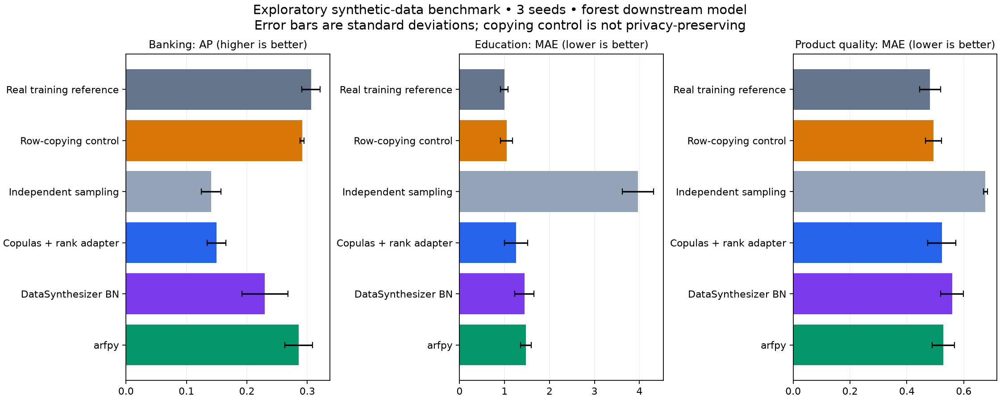

# Literature review for the general-purpose synthetic-data platform

**Prepared: 20 September 2026.** The folder name preserves the requested spelling.

This review investigates reusable tools across domains and generation methods. Healthcare is one possible application, not the project's scope. It combines published evidence, versioned software/license inspection, and actual cross-domain experiments.

## Recommended PoC direction

Start with **Faker + explicit rules** for schema-only generation and **arfpy behind an independent engine adapter** for learned single-table generation. Use an editable, versioned specification shared by the form and future LLM assistant. Export both the dataset and an evidence report. Keep DataSynthesizer as an inspectable baseline. Add Synthcity's model breadth and SmartNoise's DP path in isolated workers after dedicated experiments.

This recommendation balances observed utility, integration effort and permissive licensing. It does not say ARF wins every task or provides privacy. Current Copulas and standalone CTGAN, as well as SDV, have BSL licensing considerations. The exact package versions and license files were checked.

## Read in this order

| Document | What it answers |
|---|---|
| [Review method and scope](01_review_method_and_scope.md) | What was searched, selected, inspected, executed and left open? |
| [Literature synthesis](02_literature_synthesis.md) | How do the method families work, and what do their findings imply? |
| [Tool comparison and source traces](03_tool_comparison_and_source_traces.md) | What can we reuse, what happens inside the code, and what are the license/dependency limits? |
| [Executed benchmark report](04_benchmark_report.md) | What actually ran, how did it perform, and what do the results not establish? |
| [PoC recommendation and architecture](05_poc_recommendation_and_architecture.md) | What should we use and build first? |
| [Next experiments and work log](06_next_experiments_and_work_log.md) | What was completed and what evidence is still needed? |
| [Annotated source register](07_sources.md) | Which primary sources support each claim, and how deeply were they reviewed? |

## What was produced

- **42 source-register entries**, including 18 research publications/preprints; read depth is explicitly identified.
- **14 versioned repository/license snapshots**, eight successful upstream source captures, installed-source evidence and package dependency metadata.
- **54 successful benchmark runs across banking, education and wine quality**, using three seeds and two downstream models per run. These include reference/control runs, not 54 different tools.
- **Three schema-only demonstrations** in retail, education and sensors, producing 3,000 rows with eight passing explicit checks.
- Raw CSV measurements, generated datasets, logs, split indices, reproducible scripts, hashes and a shareable PNG/SVG chart.
- A [draft specification schema](specification/synthetic-data-spec.schema.json) and [three examples](specification/examples.json).

## Main experimental findings

| Method | Banking forest AP ↑ | Education forest MAE ↓ | Wine forest MAE ↓ |
|---|---:|---:|---:|
| Train on real data | 0.306 | 0.994 | 0.482 |
| Independent sampling | 0.141 | 3.967 | 0.676 |
| Copulas + our rank adapter | 0.150 | 1.252 | 0.523 |
| DataSynthesizer, selected BN setup | 0.230 | 1.441 | 0.559 |
| arfpy, selected setup | 0.286 | 1.471 | 0.528 |

These are three-seed means, rounded; the benchmark report contains standard deviations, linear-model results, timings and controls. AP is average precision, where higher is better. MAE is mean absolute error in each target's units, where lower is better; do not compare MAE across datasets.

**There is no universal winner.** Independent sampling illustrates why good marginal similarity need not preserve ML utility. The copying control, reported in the full benchmark, illustrates why good utility does not establish privacy.

## Important boundaries

This is an extensive targeted review with an exploratory benchmark, not an exhaustive systematic review or production audit. No private institutional records were used. Neural models, DP synthesis, adversarial privacy attacks, relational model training and the LLM were **not executed**. Their literature/source evidence and next experiments are separated from measured results.

The platform has not been implemented. The deliverable supplies evidence and a concrete integration recommendation. The first PoC supports structured tables across domains; additional modalities have their own roadmap and acceptance criteria.

## Reproduce and inspect

See the [benchmark report](04_benchmark_report.md#reproduction) for commands. Inputs are archived with [attribution and hashes](benchmarks/data/README.md). Direct dependencies are pinned in [requirements.txt](benchmarks/requirements.txt). The captured full environment is retained for diagnosis, not offered as a portable installation lockfile.

Machine-readable evidence: [sources.csv](evidence/sources.csv), [repository manifest](evidence/repository_manifest.json), [software inventory](evidence/software_inventory.md), [metrics.csv](benchmarks/results/metrics.csv), and [verification results](benchmarks/results/verification.json).

<!-- Source reference definitions generated from evidence/sources.json -->
[P01]: https://papers.neurips.cc/paper_files/paper/2019/hash/254ed7d2de3b23ab10936522dd547b78-Abstract.html
[P02]: https://faculty.washington.edu/billhowe/publications/pdfs/ping17datasynthesizer.pdf
[P03]: https://www.jstatsoft.org/article/view/v074i11
[P04]: https://proceedings.mlr.press/v206/watson23a.html
[P05]: https://arxiv.org/abs/2201.12677
[P06]: https://arxiv.org/abs/2108.04978
[P07]: https://www.usenix.org/conference/usenixsecurity22/presentation/stadler
[P08]: https://www.nature.com/articles/s41746-024-01359-3
[P09]: https://proceedings.mlr.press/v202/kotelnikov23a/kotelnikov23a.pdf
[P10]: https://proceedings.iclr.cc/paper_files/paper/2024/hash/e9750610639c3e7a849cff746bf60dbd-Abstract-Conference.html
[P11]: https://arxiv.org/abs/2210.06280
[P12]: https://arxiv.org/abs/2302.02041
[P13]: https://proceedings.neurips.cc/paper/2019/hash/c9efe5f26cd17ba6216bbe2a7d26d490-Abstract.html
[P14]: https://arxiv.org/abs/1909.13403
[P15]: https://arxiv.org/abs/2301.07573
[P16]: https://arxiv.org/abs/2607.03926
[P17]: https://proceedings.mlr.press/v244/decruyenaere24a.html
[P18]: https://arxiv.org/abs/2406.14541
[T01]: https://github.com/sdv-dev/Copulas/tree/83a004b63323026e47c11d683695f23c5f804412
[T02]: https://github.com/DataResponsibly/DataSynthesizer/tree/b969f618015d6313d03e109ad58aae2f8b12124d
[T03]: https://github.com/vanderschaarlab/synthcity/tree/23f322fe381326ed01c41b13d469a06e38cce545
[T04]: https://github.com/opendp/smartnoise-sdk/tree/677d0bb13ed6f51941739693f3d528eefc6efacf
[T05]: https://github.com/sdv-dev/SDV/tree/cb6229d83921a1cf35e7cc5b4f947bc0e03699bd
[T06]: https://github.com/sdv-dev/CTGAN/tree/66e5686fbc55a55eb137253dce115946f5785ba2
[T07]: https://github.com/sdv-dev/SDMetrics/tree/d35c170f1570387cf42085fc6c9316dad5c23a7a
[T08]: https://github.com/synthetichealth/synthea/tree/d9d07a6eef91ee5144293b42ab64224d84d124f8
[T09]: https://github.com/alan-turing-institute/tapas/tree/a7069d7e040828db0da174d1b003fa03a98e5453
[T10]: https://github.com/joke2k/faker/tree/975dd2a11d7f083cb028e2f07478ab401b5fde17
[T11]: https://github.com/worldbank/REaLTabFormer/tree/73f239643f9ea5abc877f685ce927e986302ac2d
[T12]: https://github.com/yandex-research/tab-ddpm/tree/b476257dd460b778ba09eb97f7a51d6490fa17f8
[T13]: https://github.com/tabularis-ai/be_great/tree/616b2e74b396fa1f9c7ab4412b9928eec849159a
[T14]: https://github.com/bips-hb/arfpy/tree/8b63c1b3999981125b4af2828ff52cba8e29169d
[T15]: https://github.com/DLR-RM/BlenderProc
[T16]: https://github.com/argilla-io/distilabel
[T17]: https://simpy.readthedocs.io/en/latest/
[T18]: https://www.synthpop.org.uk/about-synthpop.html
[N01]: https://csrc.nist.gov/pubs/sp/800/226/final
[N02]: https://www.nist.gov/services-resources/software/sdnist-synthetic-data-report-tool
[D01]: https://archive.ics.uci.edu/dataset/222/bank+marketing
[D02]: https://archive.ics.uci.edu/dataset/320/student+performance
[D03]: https://archive.ics.uci.edu/dataset/186/wine+quality
[D04]: https://docs.smartnoise.org/synth/index.html
