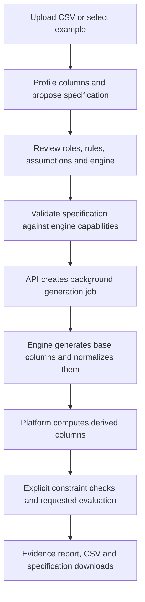
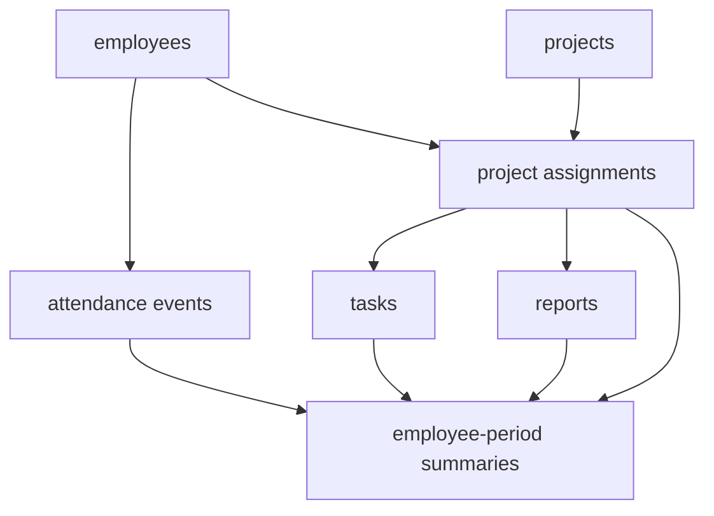

# Platform implementation review — 21 September 2026

The platform is a working specification-driven PoC with a useful architecture. Keep it and strengthen its validation and evaluation before adding more engines or an LLM. The default relational example works, but the current implementation does not yet justify general claims of relational correctness, held-out ML utility, or realistic employee behaviour.

This review examines the code and running UI produced in the workspace, including the [employee behaviour and relational review](synthetic_data_poc_employee_behavior_and_relational_review.md). Statements in that document were treated as proposals to assess, not instructions to execute. No production implementation fixes were made in this review. The new files are review documents, probes, and evidence. Building the frontend refreshed its generated output; browser checks created local demonstration jobs using generated example data.

## Evidence and limits

* Backend suite: **60 tests passed** using `/tmp/synthetic-review-venv/bin/python -m pytest tests/ -q` from `platform/backend`.
* Frontend: `npm run build` passed TypeScript and Vite; a bundle-size warning remains.
* Chrome: exercised source → employee example → generation → evidence report. No page errors were recorded. Checked desktop at 1440×1000 and the review screen at 390×844; document width remained 390px. Also uploaded a fabricated timestamp/numeric fixture, applied the new suggested fix, and reached an ARF engine failure described in R9.
* Local CSV inspection: **28,549 records, 12 columns, 236 employee identifiers; 156 missing clock-outs; 3,151 durations over 24 hours; zero negative durations**. Raw attendance records were not sent to an external model or copied into these evidence files.
* Nine focused probes cover actual implementation behaviour. These are correctness probes, not a comparative synthesis benchmark. The earlier 54-run literature-review benchmark remains separate and does not certify this new platform.
* The temporary review environment uses Python 3.12 and existing packages, including Pydantic 2.13.2 rather than the requirements file's 2.12.4. This is not a fresh-install verification of every pinned dependency.
* UI files were being updated during the review. The first inspected source lacked suggestion controls; the subsequently inspected running build includes them. Findings below reflect that correction. See the snapshot manifest for the final file hashes and versions.

Evidence: [probe source](platform_review_evidence/probes.py), [probe results](platform_review_evidence/probe_results.json), [browser script](platform_review_evidence/browser_review.cjs), [browser results](platform_review_evidence/browser_results.json), [snapshot manifest](platform_review_evidence/snapshot_manifest.json), [source screen](platform_review_evidence/ui_start.png), [relational report](platform_review_evidence/ui_relational_report.png), [mobile review](platform_review_evidence/ui_mobile_review.png).

## How it actually works

The shared contract in `spec.py` is a sound choice: identifiers, learned values, rules, derived values, constants and empty columns have different treatment. Engine adapters make replacement practical. Expression trees avoid executing arbitrary Python formulas. Privacy intent is separated from a guarantee. Those parts should survive the next iteration.

| Component | Implemented behaviour | Present limit |
|---|---|---|
| Rules/Faker | Samples declared distributions and fills identifiers/constants | Does not solve arbitrary declared constraints |
| ARF | Learns a single table from approved records | No native relational or longitudinal model; temporal features require transformation |
| Independent baseline | Samples columns separately | Useful experimental control, not a production quality target |
| Relational rules | Generates parents first and assigns existing parent keys | Second-parent cardinality, compound uniqueness and cross-table business rules are incomplete |
| Profiler | Detects types, emptiness, constants and candidate formulas | Statistical matches are hypotheses, not verified institutional policies |
| Evaluation | Explicit constraints, marginals, numerical correlations, utility and FK membership | Missing comprehensive final schema checks; utility split occurs too late |
| UI | Upload/examples, review, generate, evidence, downloads and suggested temporal fixes | No complete nontechnical schema/relationship authoring workflow |
| API | Local storage plus in-memory jobs/uploads and background threads | No durable queue, ownership controls, bounded concurrency or retention workflow |

Normalization actually happens within adapters **before** `apply_derived`, unlike the order stated in the pipeline docstring. Derived numeric values are then independently clipped and cast. That distinction causes finding R4.

## Findings, ordered by urgency

### R1 — High: output table names escape the job directory

`api.py:335` writes `out_dir / f"{name}.csv"` using an unrestricted specification table name. A specification with table `../escaped` validated and completed, writing `escaped.csv` outside its job directory. The probe confined all writes to a temporary directory and did not touch application files.

Reject unsafe names, use internally assigned artifact names, and verify resolved paths stay inside the intended job directory. Test absolute paths, separators and traversal. Treat this as a blocker before accepting specifications from other users. Filesystem permissions bound the impact, but the application currently fails its own storage boundary.

### R2 — High: reported held-out utility leaks evaluation data into synthesis

`pipeline.py:83` passes the full source to `engine.generate`; only later does `evaluate.py:246` split that source into train/test. The probe observed all **25 of 25 test rows** among the 100 source rows given to the engine.

Split before fitting the synthesizer and all data-dependent preprocessing or rule discovery used for the experiment. Keep test records unavailable to model fitting. Save the split policy and hashes. For employees, select an entity split, a time split, or both according to the prediction question; a random event split does not measure generalization to new employees. The existing scores must not be described as leakage-free utility evidence.

The utility implementation additionally assumes binary classification (`proba[:, 1]`) although the specification offers unrestricted `classification`. Validate supported targets or implement multiclass scoring. Temporal predictors and null handling also need explicit preprocessing.

### R3 — High: the final success summary omits relational and schema failures

`pipeline.py:178–179` combines only explicitly listed table constraints. It does not combine referential integrity or enforce every schema property. A modified, accepted specification with a derived FK produced **1,853 orphan rows**, while `summary.all_constraints_passed` remained `true`. Separately, a nonnullable integer column with role `empty` emitted three nulls and the same green summary.

The FK controller assigns keys before the later derivation pass, which can overwrite them. Parent keys that are derived introduce a related ordering problem. Reject unsupported key roles or finalize keys before generating descendants, and check the final frames independently. A complete status must include schema, PK uniqueness/non-nullness, required FK validity, cardinality, declared constraints and completeness. Display “no checks declared” separately from “passed.”

### R4 — High: derived values can contradict their formula while reporting zero repairs

`derive.py:250` silently clips numeric formula results. In the probe, `x=10`, formula `y=x*2`, and `y.maximum=5` produced **y=5 with zero reported repairs**. The UI says computed columns cannot contradict their inputs, but this output contradicts the declared multiplication.

Require bounds to be compatible with the computed result, or make clipping explicit in the formula and provenance. Count any intentional transformation. Never advertise a universal formula-consistency guarantee without checking the final result against its declared semantics.

### R5 — High: junction relationships ignore the second parent's contract

`relational.py:185–192` samples every secondary parent with replacement. Its one-to-one setting, child-count bounds and optionality are not applied. A probe requesting one child per project validated and generated a project with **13 children**, still with the green summary.

The ordinary example produces 50 employees, 15 projects, 1,853 attendance rows and 123 assignments, with zero orphan keys. However, it also has **9 repeated employee/project pairs**. Repeated assignments may be legitimate if a period or assignment episode is part of the business key; the schema must state that decision. FK validity alone cannot decide it.

Implement cardinality feasibility across all parents and compound uniqueness. Reject unsupported combinations before generation. Capability metadata currently says `cross_table_constraints=True` but `many_to_many=False`, despite constructing a junction table; replace these broad flags with precise supported operations. The docstring's empirical child-count claim is also ahead of the implementation: `_sample_child_counts` only samples a uniform integer range.

### R6 — Medium: temporal rewrites shift local time and discard the calendar

`suggest.py` extracts local hour using the configured offset, but rebuilds on a UTC anchor without reversing it. The round-trip probe changed **05:00 UTC to 08:00 UTC at offset +3**. `day_of_week` uses UTC while hour extraction can use local time, creating another inconsistency around midnight.

Use a consistent timezone convention for extraction and reconstruction, with named timezones when needed. Test midnight boundaries and missing values. The existing rewrite deliberately maps dates into one reference week and records this assumption; that is acceptable for a limited demonstration but unsuitable as an unnoticed transformation for monthly trends, chronological tasks or employee histories. Related timestamps should be reconstructed from a shared event time plus duration, not independently mapped into a week.

### R7 — Medium: fitted policies are presented too confidently

The profiler promotes sufficiently strong matches into derived proposals and records `assistant_proposed` provenance, which is useful. But “Business rules found” and “These columns are formulas, not behaviour” overstate that evidence. The overtime detector's agreement is computed over an eligible positive-value subset, while the visible message says a percentage “of rows.” Report numerator, denominator, eligibility conditions and exception counts.

The employee example marks the 07:45 cutoff and six-hour standard day as **user-confirmed site policies**. No confirmation is established in the reviewed conversation or supporting evidence. Mark these as demonstration assumptions pending a data owner’s confirmation. Even perfect sample agreement would not alone establish a policy's meaning or future validity.

The UI needs per-proposal accept/edit/reject actions, including keeping an imperfect relation stochastic. The newly added temporal “Apply suggested fix” is a useful start; it does not resolve confirmation of inferred institutional rules.

### R8 — Medium: scope and interaction need clearer limits

The source screen is clear, the four-step flow is understandable, and the evidence report exposes assumptions and privacy limitations. Desktop tables are legible; mobile avoids whole-page overflow, though long tables require horizontal scrolling. The report becomes very long with four tables: an at-a-glance result plus table tabs would improve navigation.

General-purpose authoring is still missing: users can upload or choose three examples, but cannot yet create arbitrary tables, roles, relationships and policies through a complete guided form. A read-only JSON view is not an editor. Start with a guided form and JSON import/export; add an LLM later as another producer of the same validated contract.

Constrain engine options by mode, source availability and supported types. Add visible retry/timeout states for polling failures. Replace absolute claims such as “orphans are impossible” and “no disclosure risk” with the tested conditions. In particular, a schema can still contain identifying literals or sensitive supplied values.

### R9 — Medium: an ordinary `value` column breaks the ARF adapter

In the browser fixture, accepting the suggested timestamp rewrite clears validation. Generating then fails with `ValueError: value_name (value) cannot match an element in the DataFrame columns.` The source fixture has a numerical column named `value`. The adapter passes user column names directly into arfpy; the installed library uses `pd.melt` with its default output name `value` internally. This is an integration failure for a normal schema, not a reason to make users rename their data manually.

Use a reversible internal column-name mapping around the engine and test collisions with the engine's bookkeeping names. Translate upstream failures into actionable messages while retaining technical details for developers. Evidence: [post-fix screen](platform_review_evidence/ui_after_suggested_fix.png) and `fixOutcome` in the browser results. This run demonstrates that the suggestion action is wired up; it does not demonstrate a successful learned end-to-end workflow.

## What the employee review gets right, and what must change

The document's strongest recommendations remain valid: preserve the grain of each table; do not infer productivity from attendance; create parent records before children; preserve provenance; compute summaries from events; keep learned relational synthesis as a later experiment.

Some statements are now stale: the implementation is no longer single-table-only. It already contains a four-table relational rules example. Treat the document as a design proposal rather than an implementation inventory. Its first graph reverses the project/assignment dependency; use the later graph with employees and projects as parents of assignments.

Attendance can support observed arrival patterns, recorded late-flag frequency, session counts, duration distributions and missing-clock-out rates, subject to data quality decisions. **Absence rate and attendance rate need expected schedules; late minutes need an approved expected start time.** Task completion, project quality and productivity need additional records or clearly invented scenarios. No synthesis method recovers those missing facts from this CSV alone.

The CLI attendance demo engineers features and filters missing/out-of-range durations; raw upload is a different path. The raw CSV initially yields four ARF type errors: three timestamp columns and one date column. The new suggestion UI can offer a rewrite, but that does not establish faithful reconstruction of this full dataset. Do not equate the feature-engineered CLI demonstration with a validated raw-CSV-to-relational workflow.

## Recommended next relational increment

Retain the parent-first engine and strengthen it rather than adding another learned engine now. Make relational support domain-neutral: entities, keys, relationships, row counts, optionality, compound uniqueness, temporal constraints and aggregates. Employee data is one template; retail customers/orders/items and education students/enrolments/courses are two further acceptance cases.

For the employee template, evolve toward:

Give tasks and reports an `assignment_id` so the employee/project pair resolves through a valid assignment. Do not generate the two foreign keys independently. If project membership can repeat, include episode or time validity in its business key. Derive summaries after the events exist, with explicit denominator and null policies. Cross-table aggregation requires a new platform operation; the present per-row expression evaluator does not provide it.

Start with rule-based distributions to demonstrate coherence. Add hybrid learned attributes only after parent/context conditioning is specified and measured. Native learned relational models remain a later, separately licensed and benchmarked experiment; they do not automatically solve missing data, privacy, or domain semantics.

The implementation order and completion criteria are in the [prioritized roadmap](platform_poc_roadmap_and_todo.md).
